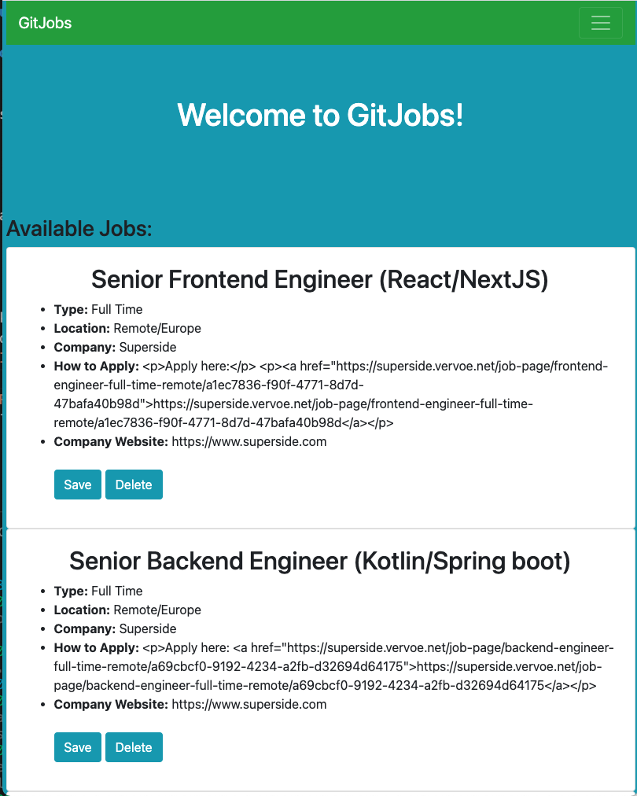
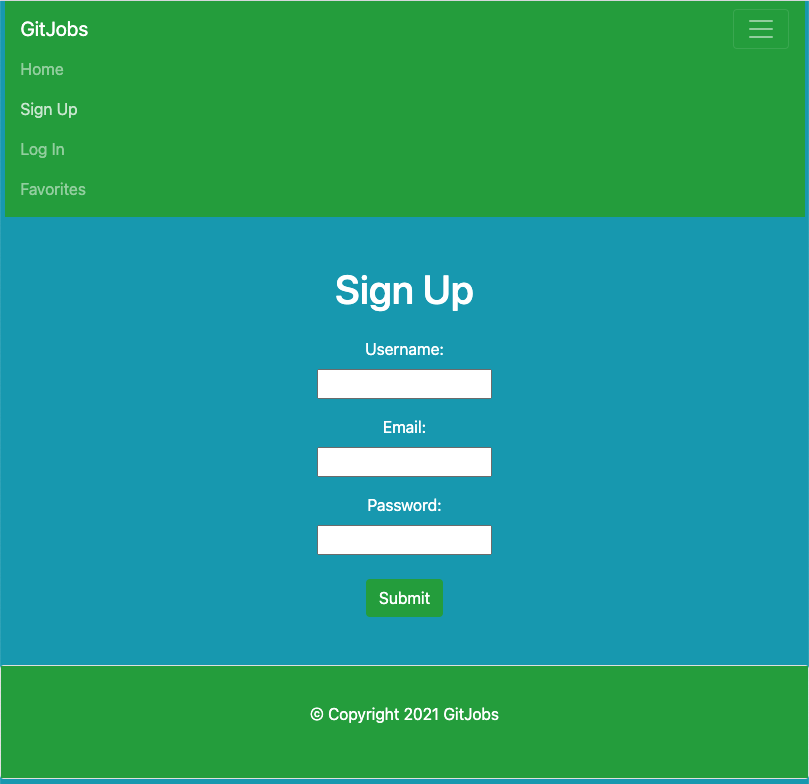
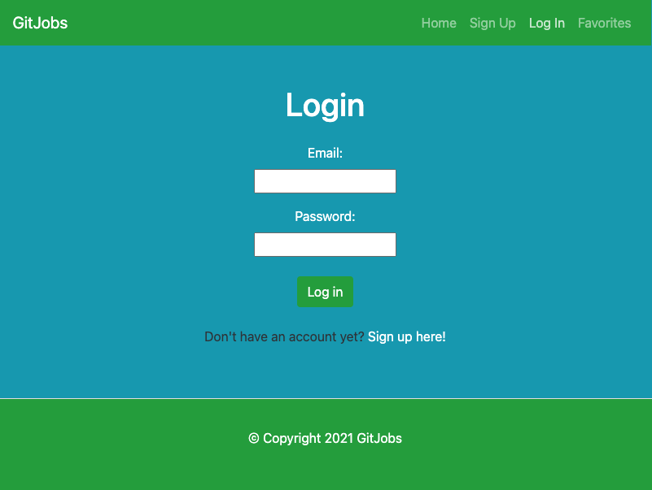

### Description 
This is the GitJobs App. This app was created through a collaborative effort of three web developers using React, React-Bootstrap, MongoDB, Mongoose and the GitHub Jobs API. 

Git Jobs app is a job search engine that helps newly graduated coding students find their first job. Due to the Covid-19 pandemic, there has been an increase of demand for remote jobs across the United States, most of the job listings are remote. Our app makes it easier for users to find their dream remote job without having to leave the comfort of their homes. 

“Looking for work online decreases the chance of discouragement and an abandoned job search by as much as 50 percent, according to research published in 2010” by the Phoenix Center. 
Businesses use free and paid job boards to post ads, targeting people in specific industries or with specific skills. Often, companies advertise anonymously, accepting resumes through the board's electronic system. Job boards let you search for jobs by location, salary, type and title. Many are updated daily, giving you continuing access to jobs as they're posted.

Below is the image of the working Home Page:

Below is the image of the working Sign Up page:

Below is an image of the working Log In page: 

### Contributers 
Claudia Hernandez [GitHub Profile](https://github.com/Claudialhc)
 
Roman Rangel [GitHub Profile](https://github.com/romanrangel)
 
Tanner Smith [GitHub Profile](https://github.com/TimothySmith66)

### Links
Heroku Deployed [Link](https://immense-hamlet-03906.herokuapp.com/home) 
 
GitHub Repo [Link](https://github.com/Claudialhc/git-jobs)

